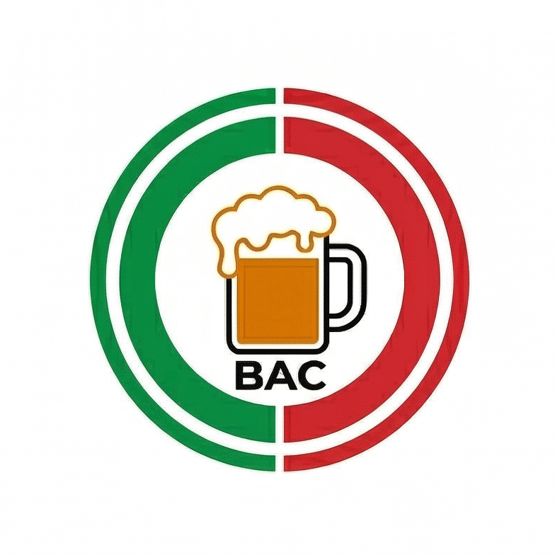
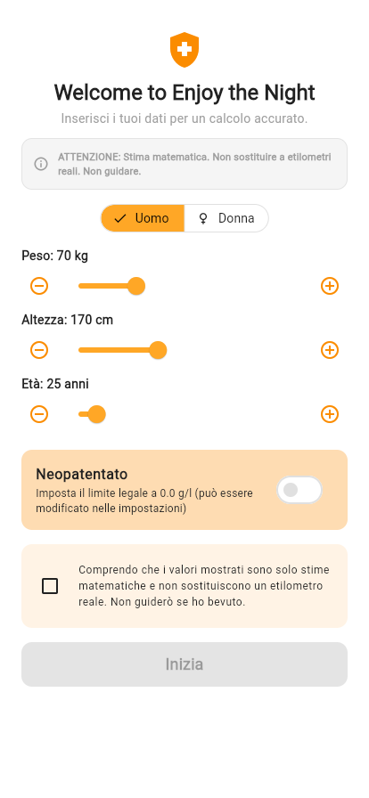

# Enjoy the Night (Sober Track)

A comprehensive mobile and web application designed to help users track their drink consumption, calculate Blood Alcohol Content (BAC) in real-time, and stay safe during nights out. 

## Tech Stack
- **Framework:** Flutter (Dart)
- **Architecture & State Management:** Provider
- **Deployment Targets:** iOS, Android, Web

## Core Features
- **Real-time BAC Calculation:** Calculates accurate BAC levels based on user profile and consumed drinks.
- **Detailed Calculation Insights & Myth-Busting [NEW]:** Interactive popups explaining how calculations work and addressing common drinking myths.
- **Health and Safety Disclaimer [NEW]:** Persistent disclaimer widget across Dashboard, History, and Settings promoting responsible drinking.
- **Multilingual Support [NEW]:** Full app localization in English, German, Spanish, French, and Italian.
- **Drink History Log:** Keeps a detailed track of all past drinks for review.
- **Quick Add Drink:** Convenient bottom sheet to log new drinks with minimal friction.

## Screenshots
Here is a look at the application in action:

## Live Demo
[Link to Live Demo / App Store Placeholder]
